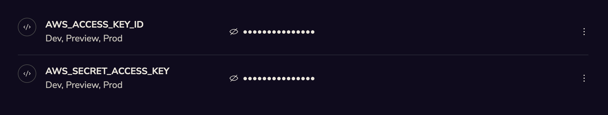

[Amazon S3](https://aws.amazon.com/s3/) is an industry leading cloud object storage solution. You can use S3 to store files, media assets, and other objects that are not well suited to storage in a database or KV store.

You can view an example of this integration on [Github](https://github.com/jetify-com/jetify-deploy-integration/tree/main/devbox-json/s3)

## Setting up S3

If you don't already have an S3 bucket configured, you will need an [AWS account](https://docs.aws.amazon.com/SetUp/latest/UserGuide/setup-overview.html) + IAM user with access to your S3 buckets. Once your account is setup, you can create an S3 Bucket using the following steps:

1. From the **Services** selector in your AWS Console, select **Storage**, then **S3**
2. On the S3 Dashboard, click **Create Bucket**, and give your bucket a name and default region
3. If your files do not need to be accessed by external, public users, leave the **Block all Public Access** button checked. Otherwise configure the permissions to match your needs
4. Once you've finished configuring the bucket, click **Create Bucket**
5. Copy the ARN and save it somewhere secure.

Once the bucket is created, you'll also need to configure [Bucket Access Policies](https://docs.aws.amazon.com/AmazonS3/latest/userguide/example-bucket-policies.html) and an [IAM User Policy](https://docs.aws.amazon.com/AmazonS3/latest/userguide/walkthrough1.html) to allow your user to securely access the bucket. Consult the S3 documentation for more details on how to configure the correct policy for your needs.

## Connecting Jetify Cloud to your S3 Account

If you want your Jetify Cloud App to push and pull objects from your S3 Bucket, you can use Jetify Secrets to set your AWS Access Key ID and Secret in your environment:

* Go to the Jetify Dashboard for your project, and navigate to Secrets. Create the following Secrets in the `Prod` environment:
  * `AWS_ACCESS_KEY_ID`: The access key for your AWS account
  * `AWS_SECRET_ACCESS_KEY`: The secret key for your AWS account
  * `AWS_BUCKET`: The name of the bucket that you will be accessing.

When you deploy your application, Devbox will automatically set these secrets as env variables in your environment. You can use these secrets with any AWS client library (such as boto3 for Python) or via the AWS CLI/SDK itself.
