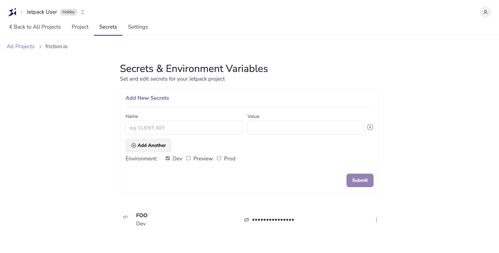

You can add or manage secrets for a Jetify Cloud project using the Secrets tab of the Jetify Dashboard. Secrets that you set in the Dashboard will be automatically available when an authenticated member of your team uses Devbox to start a shell, script, or service in the application.

## Prerequisites

To manage secrets from the Jetify Cloud Dashboard, you must first:

1. Add the project to your Jetify Cloud account
2. Initialize the project to use Jetify Secrets

## Adding a Secret

1. From the Jetify Dashboard, select the project whose secrets you want to manage
1. Navigate to the Secrets tab of the Jetify Dashboard
   
1. To create a new secret, enter the key name of the secret, along with the value that you want to set in the form. Note that secrets are set as environment variables, so the key name must be a valid environment variable name.
1. You can also use the Environment checkboxes to set the secret for a specific environment. By default, secrets are set for the `Development` environment, but you can also set secrets for a `Preview` and `Prod` environment.
1. To add multiple secrets at one time, click the **Add Another** button
1. When you are finished adding secrets, click the **Submit** button

## Updating and Managing Secrets

You can update or manage secrets by clicking the edit button next to the secret that you want to update. This will open a modal where you can update the value of the secret, or delete the secret entirely.

## Further Reading

- [Managing Secrets with the Devbox CLI](./secrets_cli.md)
