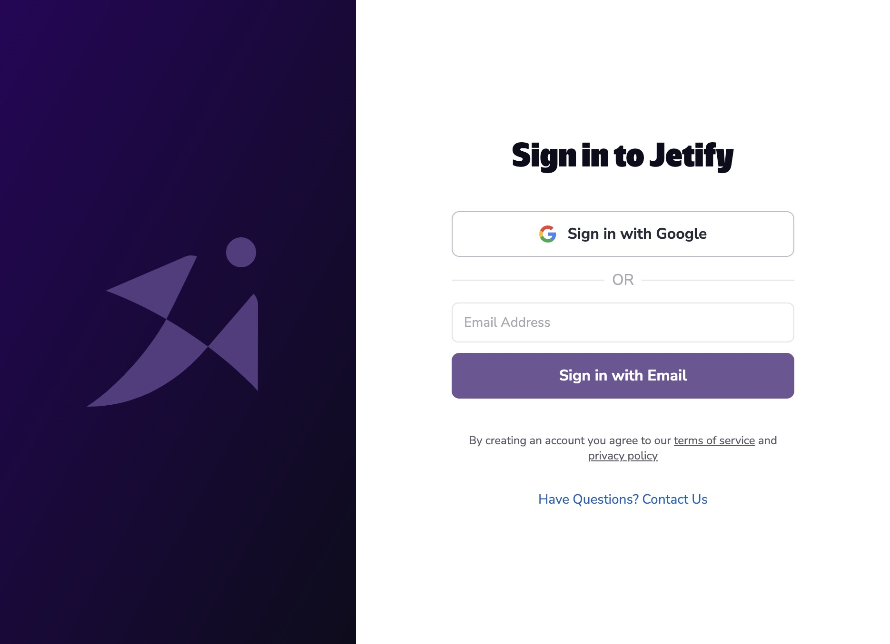

You can access your Jetify Secrets locally using Devbox. When you authenticate your Devbox CLI with Jetify Cloud, Devbox will automatically identify your project, and make your secrets available in your Devbox shell. Developers who are part of your Jetify Cloud team can also access your project’s secrets automatically, whenever they use devbox to start a shell, run a script, or launch a service

If you don't already have Devbox installed, see our [Quickstart](https://www.jetify.com/devbox/docs/quickstart/) guide to get started.

## Authenticating with Devbox

You can authenticate with Jetify Cloud by running `devbox auth login`. This will launch the browser authentication flow to sign into Jetify Cloud.



Once you complete the authentication flow and select a team, the Devbox CLI will configure itself to use the team you selected

## Integrating a project with devbox secrets

To create a new project on Jetify Cloud, navigate to the root directory of your project and run `devbox secrets init`

```bash
/Users/puckworth/my-project❯ devbox secrets init
? Setup project in /Users/puckworth/my-project? Yes
Initializing project in org
? What’s the name of your new project? my-test-project
Created project my-test-project in org
```

Running `devbox secrets init` will create a new project in your current Jetify Cloud account and org, and configure your project to use Jetify Secrets. The project should also be visible if you navigate to the [Jetify Dashboard](../dashboard/index.md).

## Adding Secrets to your Project

### Adding Secrets from the Command Line

You can set secrets using `devbox secrets set`:

```bash
envsec set FOO=BAR
```

```bash
[DONE] Set environment variable 'FOO' in environment: dev
```

By default, variables will be set on the `dev` environment. You can set secrets on other environments by passing the `--environment` flag:

```bash
devbox secrets set FOO=BAR --environment prod
```

Supported environments include `dev`, `preview`, and `prod`.

### Adding Secrets from a File

You can bulk add secrets from a file by using `devbox secrets import`:

```bash
devbox secrets import .env.dev
[DONE] Uploaded 3 environment variable(s) from file '.env.dev' to environment: dev
```

The file should follow the `.env` format, with each line containing a single environment variable in the form:

```env
VARIABLE_NAME=VARIABLE_VALUE
```

````bash

## Viewing your Project’s Secrets

You can view your project’s secrets by running `devbox secrets ls`:

```bash
Environment: dev
+-----------------+-------+
|      NAME       | VALUE |
+-----------------+-------+
| FOO             | ***** |
| DEV_SERVER      | ***** |
| PG_PASSWORD     | ***** |
+-----------------+-------+

Environment: prod
+-----------------+-------+
|      NAME       | VALUE |
+-----------------+-------+
| FOO             | ***** |
| PG_PASSWORD     | ***** |
+-----------------+-------+

Environment: preview
+-----------------+-------+
|      NAME       | VALUE |
+-----------------+-------+
| FOO             | ***** |
| PG_PASSWORD     | ***** |
+-----------------+-------+
````

## Accessing your Secrets from a Devbox Shell

Once your project is configured for Jetify Cloud, Devbox will automatically check whether the project exists in your Jetify Cloud account based on:

1. Your current project’s Git repository
2. The subfolder where your `devbox.json` is located

If you have a matching project in your Jetify Cloud account, Devbox will automatically set your secrets as environment variables whenever you:

1. Start a `devbox shell`
2. Start services with `devbox services up` or `devbox services start`
3. Run a script with `devbox run`

## Removing a Secret from your Project

You can remove a secret from your project by running `devbox secrets rm`:

```bash
devbox secrets rm FOO
[DONE] Deleted environment variable 'FOO' in environment: dev
```

## Exporting Secrets to a File

You can export your secrets to a `.env` file using `devbox secrets download`:

```bash
devbox secrets download .env
[DONE] Downloaded environment variables to '.env' for environment: dev
```

You can download from a specific environment using the `--environment` flag:

## Further Reading

- [Devbox Secrets CLI Reference](/devbox/docs/cli_reference/devbox_secrets)
- [Managing Secrets from the Dashboard](../dashboard_secrets)
