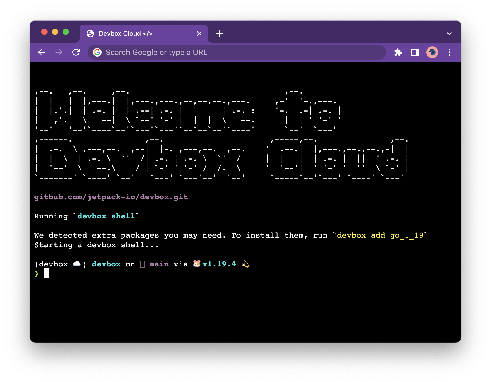

In addition to using [Devbox Cloud from your terminal](getting_started.md), you can use Devbox Cloud to preview Github projects directly in your browser. The Devbox Cloud Shell comes with the Devbox CLI preinstalled, so you can easily install your projects dependencies or run projects that include a `devbox.json`



### Getting Started

:::note
If you are trying to open a private repository in Devbox Cloud, you will first have to install the [**Devbox Cloud app**](https://github.com/apps/devbox-cloud) from the Github Marketplace. This gives Devbox Cloud permissions to clone your repositories to the cloud VMs
:::

1. Navigate to the Github Repo that you want to preview in Devbox Cloud
2. Copy the URL, and prepend it with `https://devbox.sh/`. For example, to open the Devbox repo, you would enter [https://devbox.sh/github.com/jetpack-io/devbox](http://devbox.sh/github.com/jetpack-io/devbox)
3. Follow the prompts to sign in with your Github Account.
4. Your project should now launch in a terminal session in your browser
   1. If the project has a `devbox.json` in the root directory, then Devbox will automatically install your packages and launch you into a devbox shell.
   2. If the project does not have a `devbox.json`, a blank one will be automatically created using `devbox init`. You can add packages to the VM using `devbox add`.


### Opening a specific branch of a project

You can open a specific branch of your project using the `branch` query parameter. This is useful when you want to preview a PR or WIP changes for your project. 

For example: https://devbox.sh/github.com/org/repo?branch=staging would clone the `staging` branch of your project, and open it in your Cloud Shell.


### Opening a subfolder of a project

You can start your Devbox Cloud Shell in a subfolder of your project, using the `folder` query parameter. This can be useful when working with a monorepo where your project's `devbox.json` lives in a subfolder. 

For example: https://devbox.sh/github.com/jetpack-io/devbox-examples?folder=development/ruby will start your terminal in the Ruby example in the Devbox Examples repo, load the configuration from the `devbox.json` in that folder, and then start a Devbox Shell.


### Open in Devbox Badge

If your project uses Devbox, you can make it easy for developers to test your project in Devbox Cloud by adding the `Open in Devbox` badge to your repo

[](https://devbox.sh/github.com/jetpack-io/devbox)

Add the following code to your README.md:

```md
[](https://devbox.sh/{path_to_repo})
```
