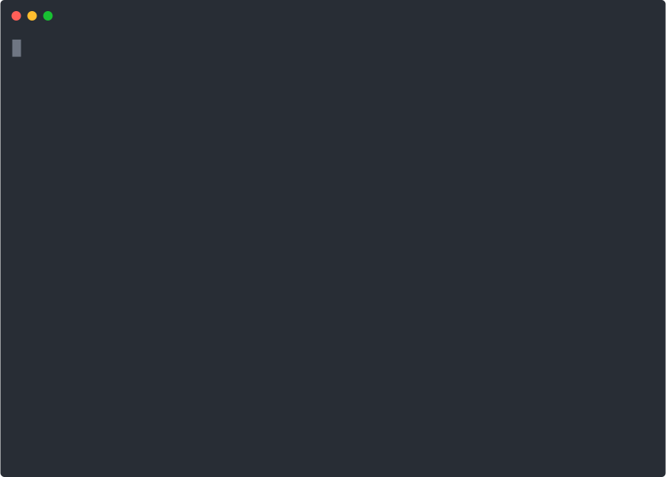

Devbox Cloud is a new way to create and run your Devbox Project in an isolated cloud environment.

Use cases for Devbox Cloud include:
* Testing out Packages or Scripts in an Isolated Linux Environment -- Preview different combinations or environments in a remote VM
* Easy Preview Environments for your project -- Developers or contributors can quickly test your project in a cloud development environment, using the same packages and configuration.
* Develop in a consistent environment from any Machine -- Log on to your Cloud Shell from anywhere, and develop in a consistent Dev environment anywhere in the world. Our VMs are deployed at the edge using Fly.io to provide a low-latency environment

:::note
Devbox Cloud is currently in Beta and under active development.
:::

<figure className="text--center">


<figcaption> Launching a Cloud Shell from the Devbox CLI </figcaption>
</figure>


## How It Works

### Prerequisites
Devbox Cloud Shell requires the following:

* **Devbox 0.3.0 or higher.** If you do not have Nix installed on your machine, Devbox will install it with the default configuration for your OS.
* **A Github Account with an SSH Key Configured**. This is used by Devbox to authenticate and connect you to your Cloud VM.


### Step 1: Authenticate with Github

Devbox provides an easy password-less login flow using the SSH keys attached to your Github Account. If you do not have SSH keys configured with Github, follow the instructions here: [Connecting to Github with SSH](https://docs.github.com/en/enterprise-server@3.4/authentication/connecting-to-github-with-ssh/about-ssh)

When you run `devbox cloud shell`, Devbox will first attempt to infer your Github username from your local environment, and prompt you if a username cannot be found.

Once Devbox has your username, it will authenticate you over SSH using the private/public key pair associated with your Github Account.

:::note
All authentication is handled via SSH. Devbox never reads or stores your private key.
:::

### Step 2: Launch your Devbox Shell in a Cloud VM

Once you are authenticated, Devbox will provision and start your Cloud Shell:
1. First, we will provision a VM within your region and connect using SSH.
2. Your local project files will be synced to the VM using Mutagen
3. Once your files are updated, Devbox will install your dependencies and start a `devbox shell` for your project

<!-- Diagram goes here -->

If you are using Devbox for the first time, this process may take over 1 minute to complete, depending on the size and number of your project's dependencies. Subsequent sessions will reuse your VM, and should boot up and start in a few seconds

#### Example: Initialize a Python Project in Cloud Shell

Let's create a simple project that uses Python 3.10 with Poetry to manage our packages. We'll start by running `devbox init` in our project directory, and then adding the packages:

```bash
devbox init
```
```bash
devbox add python@3.10 poetry
```

This should create a devbox.json in your directory that looks like the following:

```json
{
  "packages": [
    "poetry",
    "python@3.10"
  ],
  "shell": {
    "init_hook": null
  },
  "nixpkgs": {
    "commit": "52e3e80afff4b16ccb7c52e9f0f5220552f03d04"
  }
}
```
Now you can start your Cloud Shell by running `devbox cloud shell`

```md
Devbox Cloud
Remote development environments powered by Nix

✓ Created a virtual machine in Sunnyvale, California (US)
✓ File syncing started
✓ Connecting to virtual machine


Installing nix packages. This may take a while... done.
Starting a devbox shell...
...

(devbox) ~/src/devbox-cloud-test 💫 watching for changes
❯
```

You are now connected to your remote shell


### Step 3: Sync your Local Changes to Devbox Cloud

When you start your cloud session, your files are kept locally, and synchronized with your Devbox Cloud VM when changes are detected. This means you can use your favorite tools and editors to develop your project, while running in an isolated cloud environment.

#### Example: Add a Simple Flask App

Let's add a simple Flask "Hello World" to our project to test the syncing.

1. On your local machine, create a pyproject.toml file with the following:

  ```toml
  [tool.poetry]
  name = "devbox-cloud-test"
  version = "0.1.0"
  description = ""
  authors = ["Your Name <you@example.com>"]
  packages = [{include = "devbox_cloud_test"}]

  [tool.poetry.dependencies]
  python = "^3.10"
  Flask = "^2.2.2"


  [build-system]
  requires = ["poetry-core"]
  build-backend = "poetry.core.masonry.api"
  ```

1. Create a file locally called `hello.py`, with the following contents:

  ```python
    from flask import Flask

    app = Flask(__name__)

    @app.route('/')
    def index():
        return '<h1>Hello from Devbox Cloud!</h1>'
  ```

1. These files will be automatically synced to your Devbox Cloud Shell, meaning you can install and run the Flask server remotely:

```bash
poetry install
poetry run flask --app hello run
```

This should start your Flask app with the development server:

```bash
 * Serving Flask app 'hello'
 * Debug mode: off
WARNING: This is a development server. Do not use it in a production deployment. Use a production WSGI server instead.
 * Running on http://127.0.0.1:5000
Press CTRL+C to quit
```

### Step 4: Test your Services with Port-forwarding

Once your service is running, you may want to test it with your browser or local tools, or you may want to expose services running on your remote shell to your local machine.

 You can do this using `devbox cloud forward :<remote_port>`, which will forward ports from your cloud instance to your local machine. If you provide just the remote port, Devbox will forward it to a randomly assigned local port.

You can view the full list of port-forwards on your machine using `devbox cloud forward ls`. You can also terminate port=forwarding with `devbox cloud forward terminate`.

#### Example: Port-forwarding our Flask App

Our Flask app in the example above is listening on port 5000 of the remote machine. Using `devbox cloud forward`, we can access that service from our localhost:

```bash
devbox cloud forward 5000:5000

Port forwarding 5000:5000
To view in browser, visit http://localhost:5000
```

Now if we curl `localhost:5000`, we should see our message:

```bash
curl localhost:5000
<h1>Hello from Devbox Cloud!</h1>
```

## Next Steps

* Learn how to activate **[Devbox Cloud Shell in your Browser](browser_getting_started.md)**
* Try out one of our **[Examples](../devbox_examples/index.md)** in Devbox Cloud Shell
* Learn more about the **[Devbox Cloud Shell Open Beta](index.md)**
* Join the **[Discord Community](https://discord.gg/jetpack-io)**
* File an Issue or Contribute on our **[Github Repo](https://github.com/jetpack-io/devbox)**
