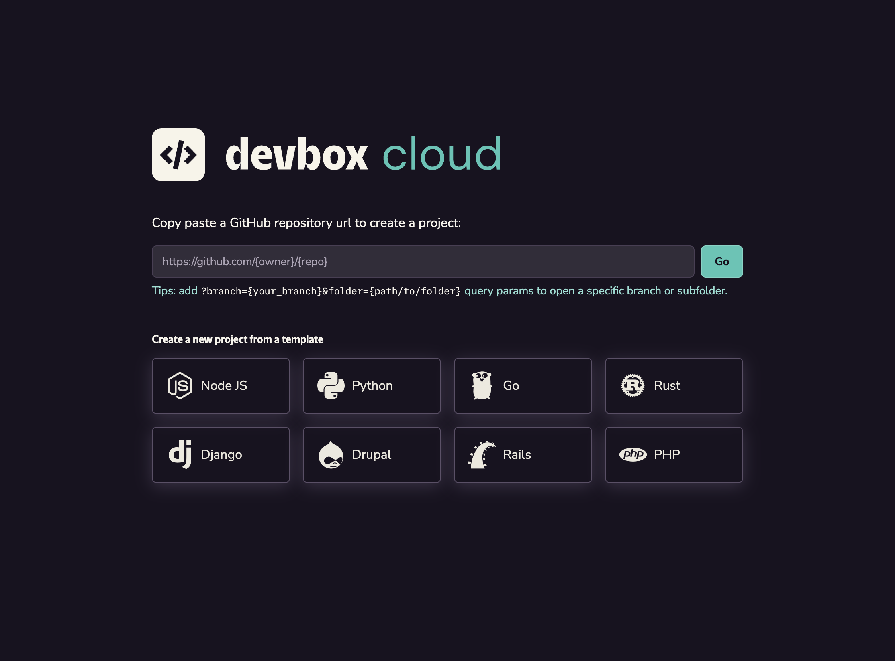
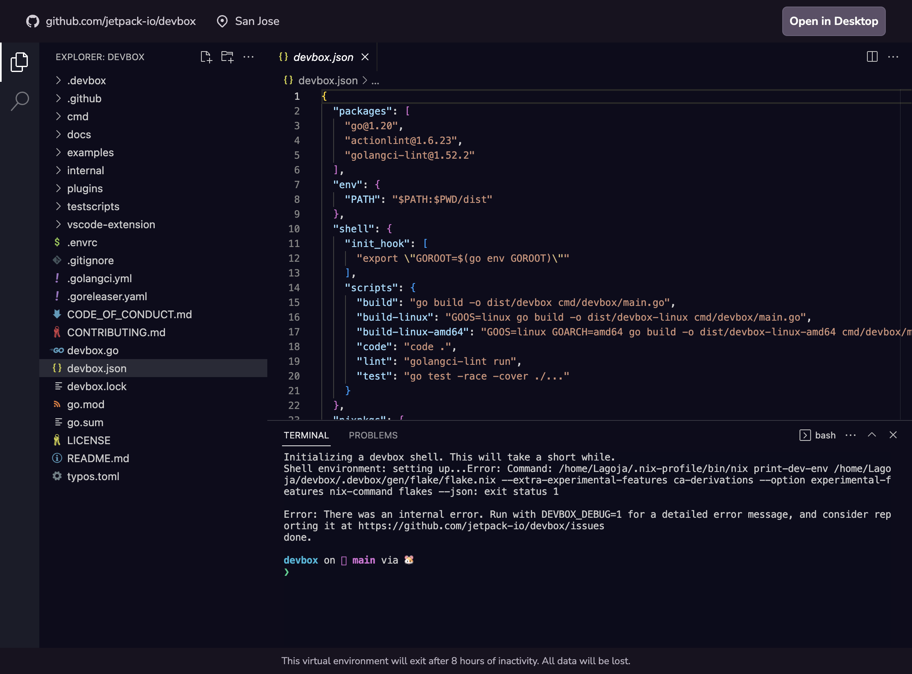

Devbox.sh provides a sandboxed playground environment for you to learn how Devbox works, try out example projects or templates, and experiment with using Devbox with your own projects.

<figure className="text--center">

[](https://devbox.sh)

<figcaption> Launch a Devbox playground at <a href="https://devbox.sh"> devbox.sh</a> </figcaption>
</figure>

## Quickstart

You can launch a new playground from your browser by visiting [devbox.sh](https://devbox.sh), or click the button below to launch a quickstart shell:

[](https://devbox.sh/new)

Each Devbox playground comes with the Devbox CLI, Nix, and several common packages preinstalled, so you can easily run projects that include a `devbox.json`



### Open a GitHub Repository in devbox.sh

:::note
If you are trying to open a private repository on Devbox.sh, we may ask you to install the [**Devbox Cloud app**](https://github.com/apps/devbox-cloud) from the Github Marketplace. This grants permissions to clone your repositories to the cloud VMs
:::

1. Navigate to the Github Repo that you want to preview on Devbox.sh
2. Copy the URL, and prepend it with `https://devbox.sh/`.
    1. For example, to open the Devbox repo, you would enter [https://devbox.sh/github.com/jetpack-io/devbox](http://devbox.sh/github.com/jetpack-io/devbox).
    1. You can also enter the URL on [devbox.sh](https://devbox.sh) and click the `Go` button
3. Follow the prompts to sign in with your Github Account.
4. Your project should now launch in a terminal session in your browser
    1. If the project has a `devbox.json` in the root directory, then Devbox will automatically install your packages and launch you into a devbox shell.
    2. If the project does not have a `devbox.json`, a blank one will be automatically created using `devbox init`. You can add packages to the VM using `devbox add`.

### Opening a Specific Branch

You can open a specific branch of your project using the `branch` query parameter. This is useful when you want to preview a PR or WIP changes for your project.

For example: https://devbox.sh/github.com/org/repo?branch=staging would clone the `staging` branch of your project, and open it in your Cloud Shell.

### Opening a Subfolder

You can open a specific a subfolder of your project using the `folder` query parameter. This can be useful when working with a monorepo where your project's `devbox.json` lives in a subfolder.

For example: https://devbox.sh/github.com/jetpack-io/devbox?folder=examples/development/ruby will start your terminal in the Ruby example in the Devbox repo, load the configuration from the `devbox.json` in that folder, and then start a Devbox shell.

### Accessing a Port

To access any non-privileged port, simply append `/port/<port_number>` to the project url. For example, the following url opens up port 8080 on the VM:

```
https://devbox.sh/app/projects/<projectId>/port/8080
```

This URL redirects to `<hostname>-<port>.svc.devbox.sh`, which points to the actual host and port of your project's VM machine.

### Opening in Desktop VS Code

Click on the `Open in Desktop` button on the top right corner, which will open up your local VS Code editor. Follow the prompt, and you should see the VS Code window refreshes and connects to the remote machine via ssh.

### Access your Playground via SSH

If you already have a GitHub SSH private key configured in your local machine, you can use it directly to SSH into your remote VM following the steps below:

1. Find out the hostname of your VM by appending `/port/8080` to your project's URL:

    ```
    https://devbox.sh/app/projects/<projectId>/port/8080
    ```

    This will redirect you to `<hostname>-8080.svc.devbox.sh`. Be sure to copy the `<hostname>` for the step below.

1. Copy your keys to the right location:

    ```
    cp ~/.ssh/id_ed25519 ~/.config/devbox/ssh/keys/<hostname>.vm.devbox-vms.internal
    ```

1. SSH into your machine:
    ```
    ssh -J proxy@proxy.devbox.sh <github_username>@<hostname>.vm.devbox-vms.internal -p 2222
    ```
    Note: `<github_username>` is case-sensitive. Make sure it matches with the github profile you sign in with.

### Add Devbox Playground to your Project's README

If your project uses Devbox, you can make it easy for developers to test your project in a Devbox playground by adding the `Open in Devbox.sh` badge to your repo

[](https://devbox.sh/github.com/jetpack-io/devbox)

Add the following code to your README.md:

```md
[](https://devbox.sh/{path_to_repo})
```