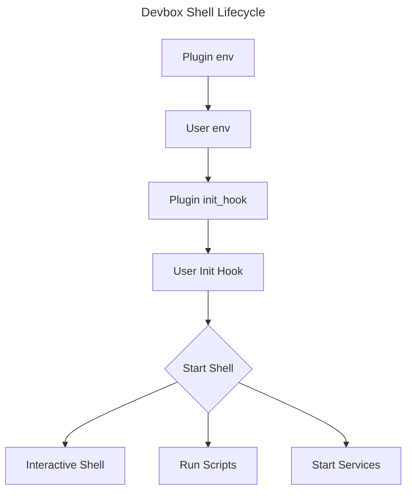

Plugins make it easier to get started with packages that require additional setup when installed with Nix, and they offer a familiar interface for configuring packages. They also help keep all of your project's configuration within your project directory, which helps maintain portability and isolation.

## Getting Started

Before writing a plugin, we recommend reading the [User Documentation](https://www.jetify.com/docs/devbox/guides/plugins/) on plugins, as well as inspecting and testing a few of the plugins in the [plugin directory](https://github.com/jetify-com/devbox/tree/main/plugins) of our repo. Note that the plugins in this directory are compiled into the Devbox binary, but your plugin can be sourced from a local directory or from within your project.

If you're looking for plugin ideas, check out our [Issues page](https://github.com/jetify-com/devbox/issues?q=is%3Aissue+is%3Aopen+label%3A%22plugin+request%22) for any user requests.

Before contributing, please consult our [Contributing Guide](https://github.com/jetify-com/devbox/blob/main/CONTRIBUTING.md) and [Code of Conduct](https://github.com/jetify-com/devbox/blob/main/CODE_OF_CONDUCT.md) for details on how to contribute to Devbox.

## Creating a Plugin

We recommend organizing your plugin with the following directory structure, where the top-level folder matches the name of your plugin:

```bash
my-plugin/
├── README.md
├── plugin.json
├── config/
│   ├── my-plugin.conf
│   └── process-compose.yaml
└── test/
    ├── devbox.json
    └── devbox.lock
```

* **README.md** -- Should contain a description of how your plugin works, and what files, variables, and services it adds to Devbox Projects
* **plugin.json** -- This file is a Go JSON Template that defines your plugin. See the sections below for more detail
* **config/** -- This folder contains any support or configuration files required by your plugin, as well as the process-compose.yaml for defining services
* **test/** -- This directory contains an example project for testing your plugin


## Plugin Design

### Plugin Lifecycle

Plugins are activated whenever a developer runs `devbox shell`, runs a script with `devbox run`, or starts a service using `devbox services start|restart`. The lifecycle of a devbox shell with plugins works as follows:



### Plugin.json Schema

Plugins are defined as Go JSON Template files, using the following schema:

```json
{
  "name": "",
  "version": "",
  "description": "",
  "packages":[] | {},
  "env": {
    "<key>": "<value>"
  },
  "create_files": {
    "<destination>": "<source>"
  },
  "shell": {
    "init_hook": [
      "<bash commands>"
    ],
     "scripts": {
      "<key>": "<value>"
    }
  },
  "include": [
   "<path_to_plugin>"
  ]
}
```

A plugin can define services by adding a `process-compose.yaml` file in its `create_files` stanza.

### Template Placeholders

Devbox's Plugin System provides a few special placeholders that should be used when specifying paths for env variables and helper files:

* `{{ .DevboxProjectDir }}` – points to the root folder of their project, where the user's `devbox.json` is stored.
* `{{ .DevboxDirRoot }}` - points to `<projectDir>/devbox.d`. This directory is public and added to source control by default.
* `{{ .DevboxDir }}` – points to `<projectDir>/devbox.d/<plugin.name>`. This directory is public and added to source control by default. This directory is not modified or recreated by Devbox after the initial package installation. You should use this location for files that a user will want to modify and check-in to source control alongside their project (e.g., `.conf` files or other configs).
* `{{ .Virtenv }}` – points to `<projectDir>/.devbox/virtenv/<plugin_name>` whenever the plugin activates. This directory is hidden and added to `.gitignore` by default You should use this location for files or variables that a user should not check-in or edit directly. Files in this directory should be considered managed by Devbox, and may be recreated or modified after the initial installation.

### Fields

#### `name` *string*

The name of your plugin. This is used to identify your plugin when a user runs `devbox info`. If `match` is not set, the plugin will automatically activate when a package is added to a devbox.json project that matches `name`.

#### `version` *string*

The version of your plugin. You should start your version at 0.0.1 and bump it whenever you merge an update to the plugin.

#### `description` *string*

Special usage instructions or notes to display when your plugin activates or when a user runs `devbox info`. You do not need to document variables, helper files, or services, since these are automatically printed when a user runs `devbox info`.

#### `packages` *string[] | object*

A list of packages that the plugin will install when activated or included in a package. This section follows the same format as [`packages`](../configuration.md#packages) section in a project's `devbox.json`.

Packages installed by a plugin can be overridden if a user installs a different version of the same package in their `devbox.json` config. For example, if a plugin installs `python@3.10`, and a user's devbox.json installs `python@3.11`, the project will use `python@3.11`.

#### `env` *object*

A map of `"key" : "value"` pairs used to set environment variables in `devbox shell` when the plugin is activated. These variables will be printed when a user runs `devbox info`, and can be overridden by a user's `devbox.json`.

#### `create_files` *object*

A map of `"destination":"source"` pairs that can be used to create or copy files into the user's devbox directory when the plugin is activated. For example:

```json
"create_files": {
    "{{ .DevboxDir }}/Caddyfile": "caddy/Caddyfile"
}
```

Will copy the Caddyfile in the `plugins/caddy` folder to `devbox.d/caddy/Caddyfile` in the user's project directory.

You should use this to copy starter config files or templates needed to run the plugin's package.

#### `shell.init_hook` *string | string[]*

A single `bash` command or list of `bash` commands that should run before the user's shell is initialized.

This will run every time a shell is started, so you should avoid any resource heavy or long running processes in this step.

#### `shell.scripts` *object*

[Scripts](../guides/scripts.md) are commands that are executed in your Devbox shell using `devbox run <script_name>`. They can be used to start up background process (like databases or servers), or to run one off commands (like setting up a dev DB, or running your tests).

Scripts can be defined by giving a name, and one or more commands. Single command scripts can be added by providing a name, and a string:

```json
{
    "shell": {
        "scripts": {
            "print_once": "echo \"Hello Once!\""
        }
    }
}
```

To run multiple commands in a single script, you can pass them as an array:

```json
{
    "shell": {
        "scripts": {
            "print_twice": [
                "echo \"Hello Once!\"",
                "echo \"Hello Twice!\""
            ]
        }
    }
}
```
Scripts defined in a plugin will be overridden if a user's `devbox.json` defines a script with the same name. For example, if both the plugin and the devbox.json that includes it defined a `print_once` script, the version in the user's `devbox.json` will take precedence in the shell.

#### `include` *string[]*

Include can be used to explicitly add extra configuration from [plugins](../guides/plugins.md) to your Devbox project. Plugins are parsed and merged in the order they are listed.

Note that in the event of a conflict, plugins near the end of the list will override plugins at the beginning of the list. Likewise, if a setting in your plugin.json conflicts with an included plugin, your setting will take precedence.
```json
{
    "include": [
        // Include a plugin from a Github Repo. The repo must have a plugin.json in it's root,
        // or in the directory specified by ?dir
        "github:org/repo/ref?dir=<path-to-plugin>"
        // Include a local plugin. The path must point to a plugin.json
        "path:path/to/plugin.json"
    ]
}
```


### Adding Services

Devbox uses [Process Compose](https://github.com/F1bonacc1/process-compose) to run services and background processes.

Plugins can add services to a user's project by adding a `process-compose.yaml` file to the `create_files` stanza. This file will be automatically detected by Devbox, and started when a user runs `devbox services up` or `devbox services start`.

See the process compose [docs](https://github.com/F1bonacc1/process-compose) for details on how to write define services in `process-compose.yaml`. You can also check the plugins in this directory for examples on how to write services.

## Testing your Plugin

Testing plugins can be done using an example Devbox project. Follow the steps below to create a new test project

1. Create a new `devbox.json` in an empty directory using `devbox init`.
1. Add your plugin to the `include` section of the `devbox.json` file.
1. Add any expected packages using `devbox add <pkg>`.
1. Check that your plugin creates the correct files and environment variables when running `devbox shell`
1. If you are looking for sample projects to test your plugin with, check out our [examples](https://github.com/jetify-com/devbox/tree/main/examples).


## Example: MongoDB

The plugin.json below installs MongoDB + the Mongo shell, and sets the environment variables and config needed to run MongoDB in Devbox.

```json
{
  "name": "mongodb",
  "version": "0.0.1",
  "description": "Plugin for the [`mongodb`](https://www.nixhub.io/packages/mongodb) package. This plugin configures MonogoDB to use a local config file and data directory for this project, and configures a mongodb service.",
  "packages": [
    "mongodb@latest"
    "mongosh@latest"
  ],
  "env": {
    "MONGODB_DATA": "{{.Virtenv}}/data",
    "MONGODB_CONFIG": "{{.DevboxDir}}/mongod.conf"
  },
  "create_files": {
    "{{.Virtenv}}/data": "",
    "{{.Virtenv}}/process-compose.yaml": "config/process-compose.yaml",
    "{{.DevboxDir}}/mongod.conf": "config/mongod.conf"
  }
}

```

## Tips for Writing Plugins

* Only add plugins for packages that require configuration to work with Devbox.
* Plugins should try to use the same configuration conventions (environment variables, configuration files) as their packages. This lets developers configure their packages in a way that they are familiar with, using existing documentation.
* If you think a user may want to override or change a parameter, define it as an environment variable in `env`. This makes it possible for a developer to override the parameter in their `devbox.json` file
* If you're adding a helper file that you think a developer would want check into source control, create it in `{{ .DevboxDir }}`. If you're creating a file that would not be checked into source control, create it in `{{ .Virtenv }}`.
* Unless there is a very good reason, we do not recommend creating files outside of `{{ .DevboxDir }}` or `{{ .Virtenv }}`. This helps keep user projects clean and well organized.
