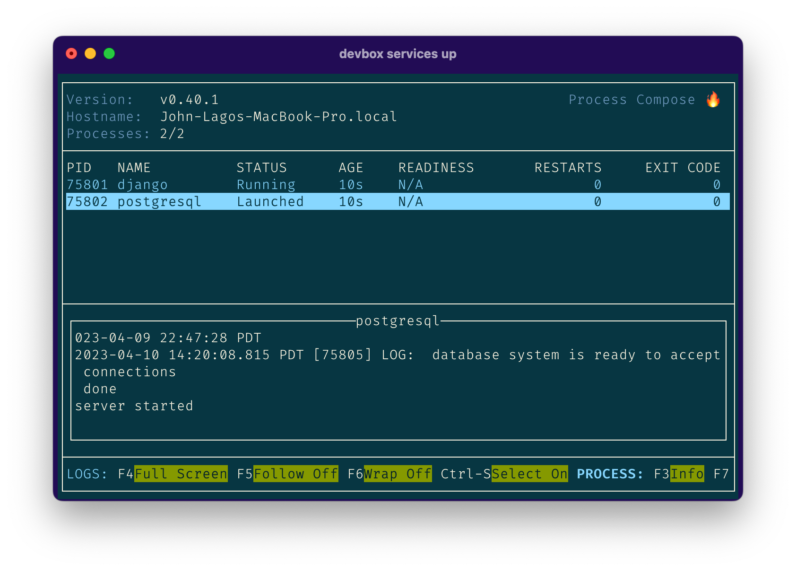

When working on an application, you often want some services or dependencies running in the background for testing. Take a web app as an example. While working on your application, you will want to test it against a running development server and database. Previously developers would manage these services via tools like Docker Compose or orchestrating them manually.

With Devbox, you can manage these services from the CLI using `devbox services`. Devbox uses [process-compose](https://github.com/F1bonacc1/process-compose#-launcher) under the hood to start and manage your project's services.

## Starting your Services

You can start all the services in your project by running `devbox services up`. This will start process-compose in the foreground, and start all the services associated with your project:



You can also start a specific service by passing the name as an argument. For example, to start just `postgresql`, you can run `devbox services up postgresql`

If you want to restart your services (for example, after changing your configuration), you can run `devbox services restart`

## Starting your Services in the Background

If you want to start your services in the background, without launching the process-compose TUI, you can use the `-b` flag. For example, to start all services in the background, you can run `devbox services up -b`.

Services started in the background will continue running, even if the current shell is closed. To stop your backgrounded services, run `devbox services stop`.

To see the current state of your running services, you can run `devbox services ls`.

You can also attach the process-compose TUI to your running background services by running `devbox services attach`.

## Defining your Own Services

If you have a process or service that you want to run with your Devbox project, you can define it using a process-compose.yml in your project's root directory. For example, if you want to run a Django server, you could add the following yaml:

```yaml
# Process compose for starting django
version: "0.5"

processes:
  django:
   command: python todo_project/manage.py runserver
   availability:
    restart: "always"
```

This will now start your django service whenever you run `devbox services up`.


## Plugins that Support Services

The following plugins provide a pre-configured service that can be managed with `devbox services`:

* [Apache](../devbox_examples/servers/apache.md) (apacheHttpd)
* [Caddy](../devbox_examples/servers/caddy.md) (caddy)
* [Nginx](../devbox_examples/servers/nginx.md) (nginx)
* [PostgreSQL](../devbox_examples/databases/postgres.md) (postgresql)
* [Redis](../devbox_examples/databases/redis.md) (redis)
* [Valkey](../devbox_examples/databases/valkey.md) (valkey)
* [PHP](../devbox_examples/languages/php.md) (php, php80, php81, php82)

The service will be made available to your project when you install the packages using `devbox add`.

## Listing the Services in our Project

You can list all the services available to your current devbox project by running `devbox services ls`. For example, the services in a PHP web app project might look like this:

```bash
devbox services ls

No services currently running. Run `devbox services up` to start them:

  django
  postgresql
```

If process-compose is already running, `devbox services ls` will show you the list of services registered with process-compose and their current status

```text
Services running in process-compose:
NAME              STATUS          EXIT CODE
django            Running         0
postgresql        Launched        0
```

## Stopping your services

You can stop your services with `devbox services stop`. This will stop process-compose, as well as all the running services associated with your project.

If you want to stop a specific service, you can pass the name as an argument. For example, to stop just `postgresql`, you can run `devbox services stop postgresql`

## Further Reading

* [**Devbox Services CLI Reference**](../cli_reference/devbox_services.md)
* [**Devbox Plugins**](plugins.md)
