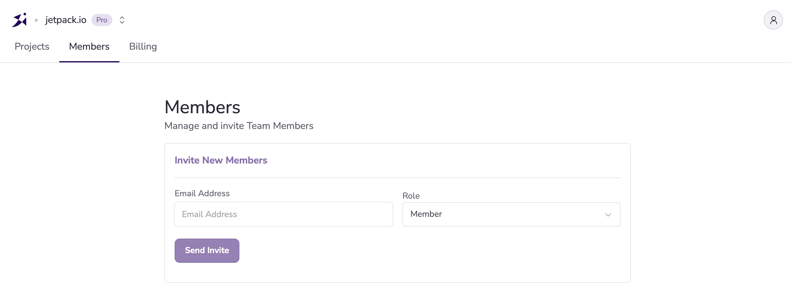
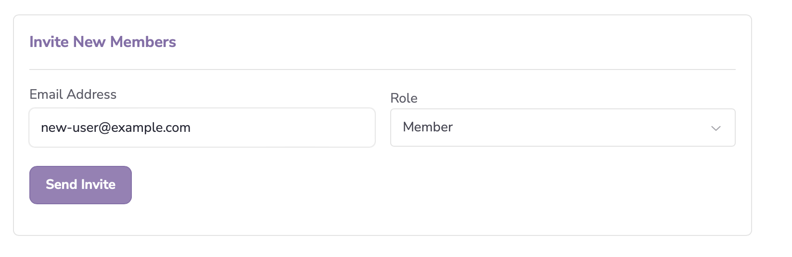
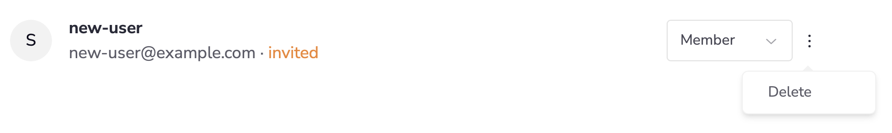

If you have a paid Team project, you can invite team members to join your project. Team members can configure and use your project’s secrets when developing using the Devbox or Envsec CLI.

:::info
If you want to invite team members to your projects, you will need to add a payment option and upgrade your account to a Team Account. 
:::

Team members can be added in one of two Roles:

- **Member:** Members can access or add projects, as well as access or modify the secrets for their projects
- **Admins:** Have all the permissions of Members, but can also invite new team members and configure project billing

## Adding a Team Member

1. In the Jetify Dashboard, navigate to the **Members** tab

   

2 . To invite a member, enter their email address, and the **Role** you want to assign to them.

1. Once invited, users will receive an email with instructions on how to join your team. They will show up in the **Members** tab as invited until they accept the invitation:

   

   Note that invitations will expire if they are not accepted within 7 days, after which you will need to re-send the invitation.

   Once they accept the invitation, they will switch to **active**

   

## Removing a Team Member

Removing a team member will remove their access to all projects and secrets in your team. To remove a team member

1. Navigate to the Members tab on the Jetify Dashboard
2. Click the Options button to the right of the the member’s name
3. Select Delete from the pop up that appears:

1. Click **OK** on the confirmation window that appears to confirm that you want to remove the member from your team
