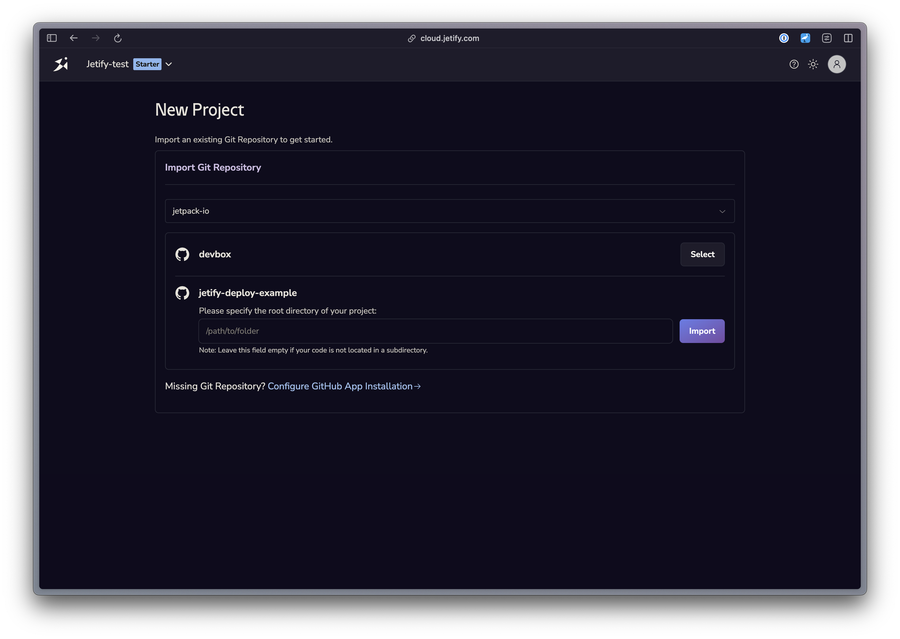

## Configuring your Project

Deploying with Jetify Cloud requires the following:

1. **A Dockerfile**. You can generate a starter dockerfile for your project by running `devbox generate dockerfile`. Devbox will automatically build and run your Dockerfile whenever you push a change to your repo. Make sure that your application code is copied into the container, and that you add a command to start your service. 
2. **A Service Listening on 8080**. Jetify automatically forwards requests to port 8080 on your running container, so you will need to ensure that your service is listening to that port. We also recommend setting your service host to `0.0.0.0`.

## Connecting your Repo

Jetify requires you to connect a Github repo in order to deploy your service. To access private repositories, you will need to install the Devbox Cloud Github app in your repository: 

1. From the Create Project screen, select Continue with Github to sign in with Github
2. Select a Github Org to import your project from. If you are only a member of one org, it will be selected for you by default. 
   1. If this is your first time importing a project from your org, you will need to install the Devbox Cloud app to provide access to your project
3. Select a Repository to import your repo. If your project is not in the root directory of your repository, you can specify a subdirectory for Jetify to search for your project. 

## Deleting your Project

If you no longer want to deploy your project with Jetify Deploys, you can delete it in the Settings tab of your project. 
