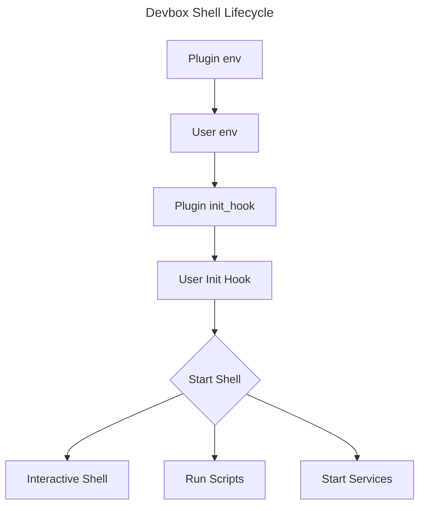

# Contributing a Plugin

Plugins make it easier to get started with packages that require additional setup when installed with Nix, and they offer a familiar interface for configuring packages. They also help keep all of your project's configuration within your project directory, which helps maintain portability and isolation.

## Getting Started

Before writing a plugin, we recommend reading the [User Documentation](https://www.jetify.com/devbox/docs/guides/plugins/) on plugins, as well as inspecting and testing a few of the plugins in this directory. Note that the plugins in this directory are compiled into the Devbox binary, but your plugin can be sourced from a local directory or from within your project.

If you're looking for plugin ideas, check out our [Issues page](https://github.com/jetify-com/devbox/issues?q=is%3Aissue+is%3Aopen+label%3A%22plugin+request%22) for any user requests.

Before contributing, please consult our [Contributing Guide](../CONTRIBUTING.md) and [Code of Conduct](../CODE_OF_CONDUCT.md) for details on how to contribute to Devbox.

### Testing your Plugin

1. Create a new `devbox.json` in an empty directory using `devbox init`.
2. Add your plugin to the `include` section of the `devbox.json` file. Add any expected packages using `devbox add <pkg>`.
3. Check that your plugin creates the correct files and environment variables when running `devbox shell`
4. If you are looking for sample projects to test your plugin with, check out our [examples](https://github.com/jetify-com/devbox/tree/main/examples).

## Plugin Design

Plugins are defined as Go JSON Template files, using the following schema:

```json
{
  "name": "",
  "version": "",
  "description": "",
  "env": {
    "<key>": "<value>"
  },
  "create_files": {
    "<destination>": "<source>"
  },
  "init_hook": [
    "<bash commands>"
  ]
}
```

A plugin can define services by adding a `process-compose.yaml` file in its `create_files` stanza.

### Plugin Lifecycle

Plugins are activated whenever a developer runs `devbox shell`, runs a script with `devbox run`, or starts a service using `devbox services start|restart`. The lifecycle of a devbox shell with plugins works as follows:



### Template Placeholders

Devbox's Plugin System provides a few special placeholders that should be used when specifying paths for env variables and helper files:

* `{{ .DevboxDirRoot }}` – points to the root folder of their project, where the user's `devbox.json` is stored.
* `{{ .DevboxDir }}` – points to `<projectDir>/devbox.d/<plugin.name>`. This directory is public and added to source control by default. This directory is not modified or recreated by Devbox after the initial package installation. You should use this location for files that a user will want to modify and check-in to source control alongside their project (e.g., `.conf` files or other configs).
* `{{ .Virtenv }}` – points to `<projectDir>/.devbox/virtenv/<plugin_name>` whenever the plugin activates. This directory is hidden and added to `.gitignore` by default You should use this location for files or variables that a user should not check-in or edit directly. Files in this directory should be considered managed by Devbox, and may be recreated or modified after the initial installation.

### Fields

#### `name` *string*

The name of your plugin. This is used to identify your plugin when a user runs `devbox info`. If `match` is not set, the plugin will automatically activate when a package is added to a devbox.json project that matches `name`.

#### `version` *string*

The version of your plugin. You should start your version at 0.0.1 and bump it whenever you merge an update to the plugin.

#### `match` *string*

A regex expression that is used to identify when the plugin will be activated. Devbox will activate your plugin when a package installed with `devbox add` matches this regular expression.

The regex you provide should match a package name. You can look up packages at `nixhub.io`

#### `readme` *string*

Special usage instructions or notes to display when your plugin activates or when a user runs `devbox info`. You do not need to document variables, helper files, or services, since these are automatically printed when a user runs `devbox info`.

#### `env` *object*

A map of `"key" : "value"` pairs used to set environment variables in `devbox shell` when the plugin is activated. These variables will be printed when a user runs `devbox info`, and can be overridden by a user's `devbox.json`.

#### `create_files` *object*

A map of `"destination":"source"` pairs that can be used to create or copy files into the user's devbox directory when the plugin is activated. For example:

```json
"create_files": {
    "{{ .DevboxDir }}/Caddyfile": "caddy/Caddyfile"
}
```

Will copy the Caddyfile in the `plugins/caddy` folder to `devbox.d/caddy/Caddyfile` in the user's project directory.

You should use this to copy starter config files or templates needed to run the plugin's package.

#### `init_hook` *string | string[]*

A single `bash` command or list of `bash` commands that should run before the user's shell is initialized. This will run every time a shell is started, so you should avoid any resource heavy or long running processes in this step.

### Adding Services

Devbox uses [Process Compose](https://github.com/F1bonacc1/process-compose) to run services and background processes.

Plugins can add services to a user's project by adding a `process-compose.yaml` file to the `create_files` stanza. This file will be automatically detected by Devbox, and started when a user runs `devbox services up` or `devbox services start`.

See the process compose [docs](https://github.com/F1bonacc1/process-compose) for details on how to write define services in `process-compose.yaml`. You can also check the plugins in this directory for examples on how to write services.

## Tips for Writing Plugins

* Only add plugins for packages that require configuration to work with Devbox.
* Plugins should try to use the same configuration conventions (environment variables, configuration files) as their packages. This lets developers configure their packages in a way that they are familiar with, using existing documentation.
* If you think a user may want to override or change a parameter, define it as an environment variable in `env`. This makes it possible for a developer to override the parameter in their `devbox.json` file
* If you're adding a helper file that you think a developer would want check into source control, create it in `{{ .DevboxDir }}`. If you're creating a file that would not be checked into source control, create it in `{{ .Virtenv }}`.
* Unless there is a very good reason, we do not recommend creating files outside of `{{ .DevboxDir }}` or `{{ .Virtenv }}`. This helps keep user projects clean and well organized.
